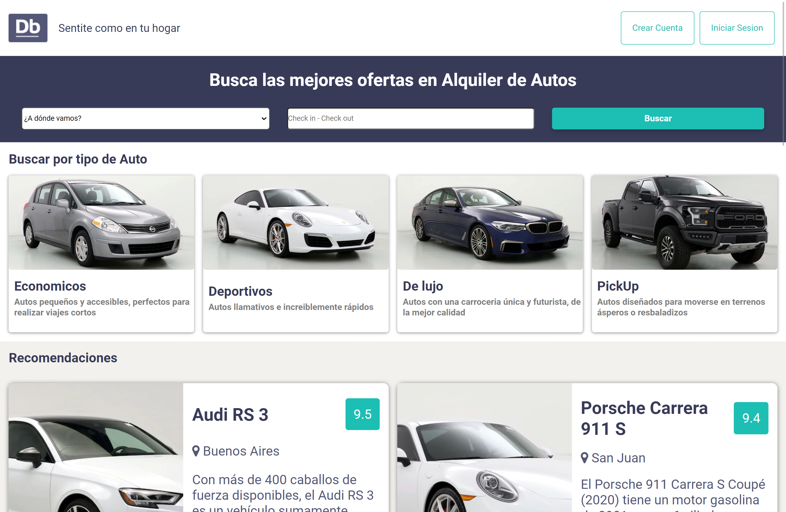

<!-- PROJECT LOGO -->
 

  

<h3 align="center">Digital Booking</h3>

  

    <a href="https://www.digitalhouse.com/ar/productos/programacion/certified-tech-developer"><strong>Proyecto Intregrador</strong> de la carrera Certified Tech Developer</a> .
     
     
    <a href="http://fvb-grupo9-front.s3-website.us-east-2.amazonaws.com/"><strong>Explora el proyecto</strong></a>
  

<!-- Sobre el proyecto -->
## Sobre el Proyecto :
En Digital Booking nuestra misión es hacer que la reserva de un auto sea una experiencia digital fácil, rápida y satisfactoria para nuestros usuarios.

El proyecto consiste en el desarrollo web de una app para reservas de autos. Para ello trabajando con la metodología ágil SCRUM y todo lo aprendido durante la cursada pudimos implementar y alcanzar todos los requerimientos que nos fue solicitado el cliente

En total fuimos 5 integrantes cada uno con sus roles aunque también ayudándonos mutuamente, el front-end 100% responsive, cumpliendo con el diseño otorgado en Figma y la api del proyecto fue realizada en Java. El deployment se realizó en AWS y también fue testeado utilizando distintas técnicas.

<!-- Rol en el equipo -->
## Rol

Personalmente, mi rol en el proyecto mayormente fue el de desarrollador front-end encargándome que el front consuma los datos de la api provenientes del back y de la implementación general.

Además en los últimos sprints me vi envuelto en tareas de back-end y bases de datos , colaborando con mis compañeros , cargando información a la base de datos como también en la relación de tablas y en el back-end con el desarrollo de la api.

## Metodologia de Trabajo

SCRUM fue la metodología ágil aplicada, lo que nos permitió encarar el proyecto de una forma mucho más rápida y eficiente. Nuestra primera fase fue la de planificación, allí establecimos las tareas prioritarias y designamos qué tareas se asignaban a cada miembro del equipo y estimamos el tiempo necesario que cada tarea precisaba para cumplirse.

Agendamos con el scrum team un meeting diario para evaluar el trabajo que cada miembro iba realizando y detallar si algún problema se había presentado. La ejecución del proyecto se abordó en 4 sprints de 2 semanas cada uno, y al final de cada sprint, pautamos una sprint review junto al cliente para mostrar los resultados obtenidos, lo que nos permitió estar en un mejoramiento continuo y presentar al final un proyecto adaptado a los requerimientos y necesidades del cliente.

<!-- Tecnologias -->
### Proyecto realizado con :

* [![React][React.js]][React-url]
* [![React-router][React-router]][React-router-url] 
* [![Spring][Spring]][Spring-url]
* [![jwt][jwt]][jwt-url]
* [![npm][npm]][npm-url]
* [![AWS][AWS]][AWS-url] 
* [![GitLab][GitLab]][GitLab-url]
* [![GitHub][GitHub]][GitHub-url]
* [![Selenium][Selenium]][Selenium-url]
* [![Jest][Jest]][Jest-url]
* [![Swagger][Swagger]][Swagger-url]
* [![Trello][Trello]][Trello-url]
* [![Postman][Postman]][Postman-url]
* [![VSC][VSC]][VSC-url]
* [![IntelliJ][IntelliJ]][IntelliJ-url]
* [![Hibernate][Hibernate]][Hibernate-url]
* [![MySQL][MySQL]][MySQL-url]

<!-- CONTACT -->
## Contacto

[![linkedin][linkedin-shield]][linkedin-url]

📩 : lvcaszelaya@gmail.com

(<a href="#readme-top">Volver al inicio</a>)

<!-- MARKDOWN LINKS & IMAGES -->
<!-- https://www.markdownguide.org/basic-syntax/#reference-style-links -->
[linkedin-shield]: https://img.shields.io/badge/-LinkedIn-black.svg?style=for-the-badge&logo=linkedin&colorB=555
[linkedin-url]: https://www.linkedin.com/in/lucasivanzelaya/
[product-screenshot]: images/screenshot.png
[AWS]: https://img.shields.io/badge/AWS-%23FF9900.svg?style=for-the-badge&logo=amazon-aws&logoColor=white
[AWS-url]: https://aws.amazon.com/
[GitLab]: https://img.shields.io/badge/gitlab-%23181717.svg?style=for-the-badge&logo=gitlab&logoColor=white
[GitLab-url]: https://about.gitlab.com/
[GitHub]: https://img.shields.io/badge/github-%23121011.svg?style=for-the-badge&logo=github&logoColor=white
[GitHub-url]: https://github.com/
[React.js]: https://img.shields.io/badge/React-20232A?style=for-the-badge&logo=react&logoColor=61DAFB
[React-url]: https://reactjs.org/
[React-router]: https://img.shields.io/badge/React_Router-CA4245?style=for-the-badge&logo=react-router&logoColor=white
[React-router-url]: https://reactrouter.com/en/main
[Spring]: https://img.shields.io/badge/spring-%236DB33F.svg?style=for-the-badge&logo=spring&logoColor=white
[Spring-url]: https://spring.io/
[jwt]: https://img.shields.io/badge/JWT-black?style=for-the-badge&logo=JSON%20web%20tokens
[jwt-url]: https://jwt.io/
[npm]: https://img.shields.io/badge/NPM-%23000000.svg?style=for-the-badge&logo=npm&logoColor=white
[npm-url]: https://www.npmjs.com/

[Selenium]: https://img.shields.io/badge/-selenium-%43B02A?style=for-the-badge&logo=selenium&logoColor=white
[Selenium-url]: https://www.selenium.dev/
[Jest]: https://img.shields.io/badge/-jest-%23C21325?style=for-the-badge&logo=jest&logoColor=white
[Jest-url]: https://jestjs.io/
[Swagger]: https://img.shields.io/badge/-Swagger-%23Clojure?style=for-the-badge&logo=swagger&logoColor=white
[Swagger-url]: https://swagger.io/

[Trello]: https://img.shields.io/badge/Trello-%23026AA7.svg?style=for-the-badge&logo=Trello&logoColor=white
[Trello-url]: https://trello.com/
[Postman]: https://img.shields.io/badge/Postman-FF6C37?style=for-the-badge&logo=postman&logoColor=white
[Postman-url]: https://www.postman.com/
[VSC]: https://img.shields.io/badge/Visual_Studio_Code-0078D4?style=for-the-badge&logo=visual%20studio%20code&logoColor=white
[VSC-url]: https://code.visualstudio.com/
[IntelliJ]: https://img.shields.io/badge/IntelliJ_IDEA-000000.svg?style=for-the-badge&logo=intellij-idea&logoColor=white
[IntelliJ-url]: https://www.jetbrains.com/es-es/idea/
[Hibernate]: https://img.shields.io/badge/Hibernate-59666C?style=for-the-badge&logo=Hibernate&logoColor=white
[Hibernate-url]: https://hibernate.org/
[MySQL]: https://img.shields.io/badge/MySQL-00000F?style=for-the-badge&logo=mysql&logoColor=white
[MySQL-url]: https://www.mysql.com/
